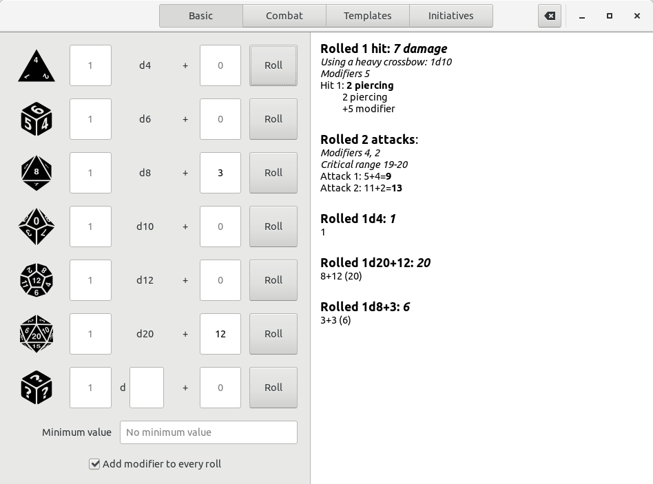

# About Natural One

Natural One is a dice roller designed primarily for the Pathfinder tabletop roll-playing game, though
it is of course usable as a general purpose dice roller.

In addition to basic dice roller features, Natural One also includes stats for all Pathfinder weapons. 
Rolling for damage is as simple as selecting the weapon.

The template feature makes larger, more complex rolls much easier. Don't want to roll base damage,
elemental damage, and sneak attacks every turn? Simply enter this in as a template and roll them all
at once. 

# Using Natural One

WeatherLog requires the Python interpreter to run. Development is done using 2.7.x, but it should work
with 3.x as well. GTK+ 3 and its Python bindings are also required. 

To run Natural One, open a terminal in the directory containing the files and type `python naturalone.py`.
On some systems double-clicking on the `naturalone.py` file will also work.

Natural One has only been tested on Linux.

# License

Natural One is released under the [GNU General Public License version 3](https://www.gnu.org/licenses/gpl-3.0.txt).
See the `LICENSE.md` file for more information.

Icons:
* Program icon from a set by [Nick Roach](https://www.iconfinder.com/iconsets/circle-icons-1), released
under the GNU GPL v3.